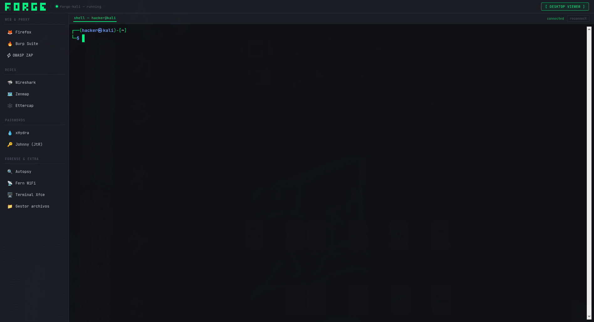

<p align="center">
  <a href="https://github.com/dwotV/forge">
    <picture>
      
    </picture>
  </a>
</p>
<p align="center">A new hacking enviroment structure.</p>

<p align="center">
  
</p>

---

### Installation

```bash
git clone https://github.com/dwotV/forge.git
cd forge
docker compose up -d --build
```
