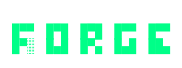
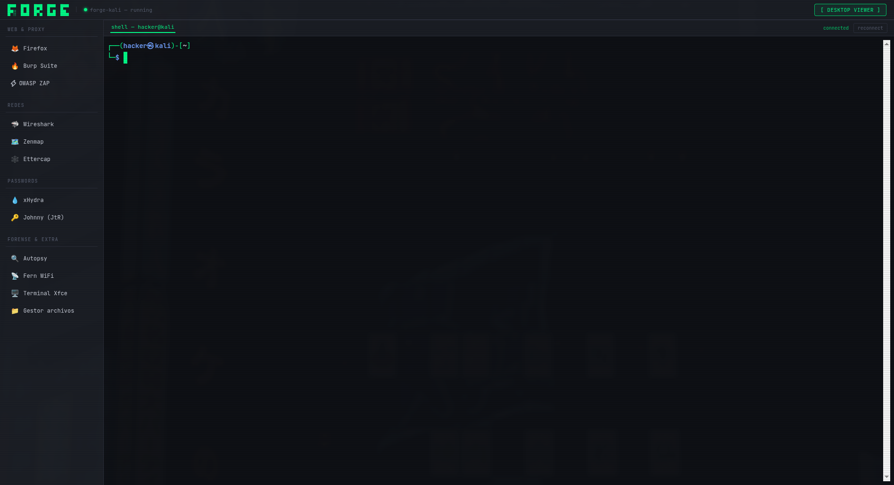

<p align="center">
  <a href="https://github.com/dwotV/forge">
    <picture>
      
    </picture>
  </a>
</p>
<p align="center"><b>An environment forged for hacking.</b></p>

<p align="center">
  <a href="https://docs.docker.com/manuals/"></a>
  <a href="https://www.python.org/downloads/"></a>
  <a href="https://github.com/pypa/pipx"></a>
</p>

<p align="center">
  
</p>

---

## Overview

**Forge** is a comprehensive platform built for security professionals, penetration testers, and CTF enthusiasts. It provides an isolated **Linux** virtualized container environment supporting web-based desktop access via VNC, remote tool execution via REST APIs, a powerful Python-based management CLI, and AI-driven automation via the **Model Context Protocol (MCP)**.

---

## Installation

1. **Clone the repository:**
   ```bash
   git clone https://github.com/dwotV/forge.git
   cd forge
   ```

2. **Configure environment variables:**
   ```bash
   cp .env.example .env
   # Edit .env to adjust credentials or port settings if needed
   ```

3. **Install the Forge CLI:**
   ```bash
   pipx install ./cli
   ```

4. **Deploy the environment:**
   ```bash
   forge install
   # Or directly via Docker Compose:
   # docker compose up -d --build
   ```

---

## Quick Start

Once deployed, access the services:

- **Web Dashboard:** `http://localhost:8080`
- **noVNC Desktop:** `http://localhost:6080`
- **Backend API:** `http://localhost:3000`
- **Kali REST API:** `http://localhost:4000`

### Useful CLI Commands:
```bash
# Check service health and status
forge status

# Launch an interactive shell in Kali Linux
forge shell

# Stop all services
forge stop
```

---

## Key Features

### Web Interface
- **Browser Desktop:** Access the full Forge environment GUI directly from your browser via noVNC.
- **One-Click App Launcher:** Instant launching of tools like Burp Suite, Wireshark, Firefox, OWASP ZAP, Ghidra, and more.
- **Integrated Web Terminal:** Interactive shell access straight from the web panel.

### REST API & Tool Execution
- **Synchronous Execution:** Execute binaries/tools (`nmap`, `gobuster`, `hydra`, `sqlmap`) and retrieve `stdout`, `stderr`, exit code, and execution time.
- **Background Jobs:** Run long scans or processes asynchronously with status tracking, output polling, and job management.
- **Resource Controls:** Configurable execution timeouts and stdout/stderr output buffer truncation.

### Management CLI
A modern Python CLI built with `Click` and `Rich` to handle the environment lifecycle:
- `forge install`: Pulls, builds, and initializes the environment.
- `forge start` / `forge stop` / `forge restart`: Service lifecycle controls.
- `forge status`: Visual overview of container health, port mappings, and resources.
- `forge shell`: Opens an interactive shell inside the running Kali container.

### MCP Server (`forge-mcp`)
Connect AI assistants (e.g. Claude Desktop, Antigravity, or any MCP client) to automate security workflows:
- `forge_status`: Environment health check.
- `forge_launch_app` / `forge_close_app`: GUI application management.
- `forge_list_tools`: Catalog of available tools grouped by category (recon, web, exploit, forensics, etc.).
- `forge_exec` / `forge_exec_bg`: Synchronous and asynchronous command execution.
- `forge_list_jobs`, `forge_job_status`, `forge_job_kill`: Background job inspection and management.

---

## Environment Configuration

Customize your setup via `.env`:

| Variable | Description | Default |
|---|---|---|
| `KALI_USER` | Non-root user inside Kali | `kali` |
| `KALI_PASSWORD` | User and VNC password | `forge` |
| `VNC_RESOLUTION` | VNC display resolution | `1280x800` |
| `TIME_ZONE` | Container time zone | `UTC` |

---

## MCP Integration for AI Assistants

To connect Forge with an MCP client (such as Claude Desktop or Antigravity), add the following entry to your `mcp_config.json`:

### Opencode
```json
{
  "$schema": "https://opencode.ai/config.json",
  "autoupdate": false,
  "mcp": {
    "forge-mcp": {
      "type": "local",
      "command": ["/absolute/path/to/forge/.forge/mcp-venv/bin/python3", "/absolute/path/to/forge/mcp/server.py"],
      "enabled": true,
    },
  },
}
```
```
```

### Claude Desktop/Code
```json
{
  "mcpServers": {
    "forge": {
      "command": "/absolute/path/to/forge/.forge/mcp-venv/bin/python3",
      "args": ["/absolute/path/to/forge/mcp/server.py"],
      "env": {
        "BACKEND_URL": "http://localhost:3000",
        "KALI_API_URL": "http://localhost:4000"
      }
    }
  }
}
```

---

<p align="center">Created by <a href="https://github.com/dwotV">dwotV</a> — Forged for Hacking & Security Research.</p>
